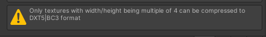

# sprita

sprita is a tool to automate sprite preparation for game ready assets.

## What does sprita do?

- Cleans the empty spaces around the sprite for a more efficient sprite storage

  

- **Optional**. Downsize the image according to the `--max-size` argument.

  

- Adds padding to the sprite. Below is a comparison between a sprite without padding (left) and a sprite with 1px padding (right)

  

  In the image below, notice how without the padding, the sprite gets cut off on the edges, instead of interpolated like the padded sprite. Note: of course, this is only noticeable when the sprites are displayed way beyond the supposed pixels per unit density.

  

- Optimizes the sprite dimensions to a multiple of 4. This is true only for specific image compressions (BC3, DXT5, ETC2).

  

## Installation

1. Build (Optional). A binary version can also be downloaded from releases section.

```bash
cargo build --release
```

2. Place the binary in a directory that is registered in PATH, or create a link to the executable there.

## Usage

### Basic usage

```bash
# Single file, output must specify the extension
sprita -i ball.png -o ball_optimized.png

# This will throw an error
sprita -i ball.png -o ball

# Entire directory as input
# Will try to optimize every image file in the dir.
sprita -i ./img -o ./img/optimized
```

> Note: `--input` and `--output` parameters are required.

### Forcing an overwrite

```bash
sprita -i ball.png -o ball_optimized.png -f
```

### Downsizing

```bash
sprita -i ball.png -o ball_optimized.png -d --max-size 240
```

> Note: downsizing will also optimize the image.

> Note: downsizing operation will be skipped if the input file size is smaller than `--max-size`

## Credits

ball.png, taken from [kenney.nl](https://www.kenney.nl/assets/rolling-ball-assets)
