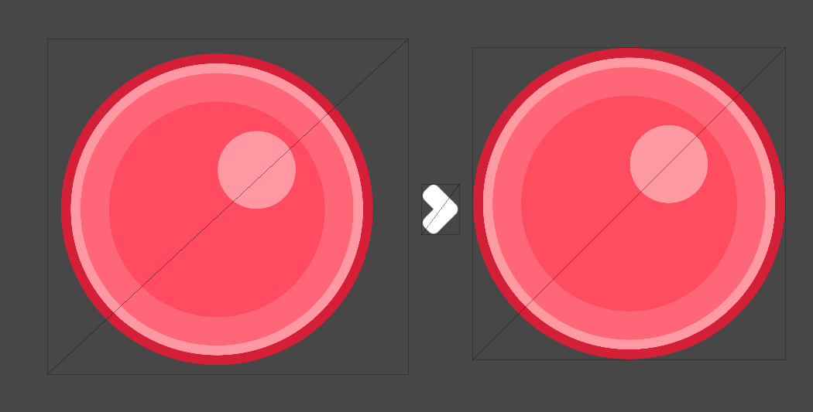
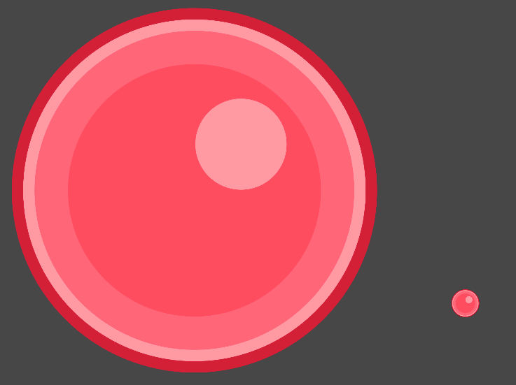

# sprita

sprita is a sprite preparing tool for game development.

## What does sprita do?

- Cleans the empty spaces around the sprite for a more efficient sprite storage

    

- **Optional**. Downsize the image according to the `--max-size` argument.

    

- Adds padding to the sprite. Below is a comparison between a sprite without padding (left) and a sprite with 1px padding (right)

    

    In the image below, notice how without the padding, the sprite gets cut off on the edges, instead of interpolated like the padded sprite. Note: of course, this is only noticeable when the sprites are displayed way beyond the supposed pixels per unit density.

    

- Optimizes the sprite dimensions to a multiple of 4. This is true only for specific image compressions (BC3, DXT5, ETC2).

    
